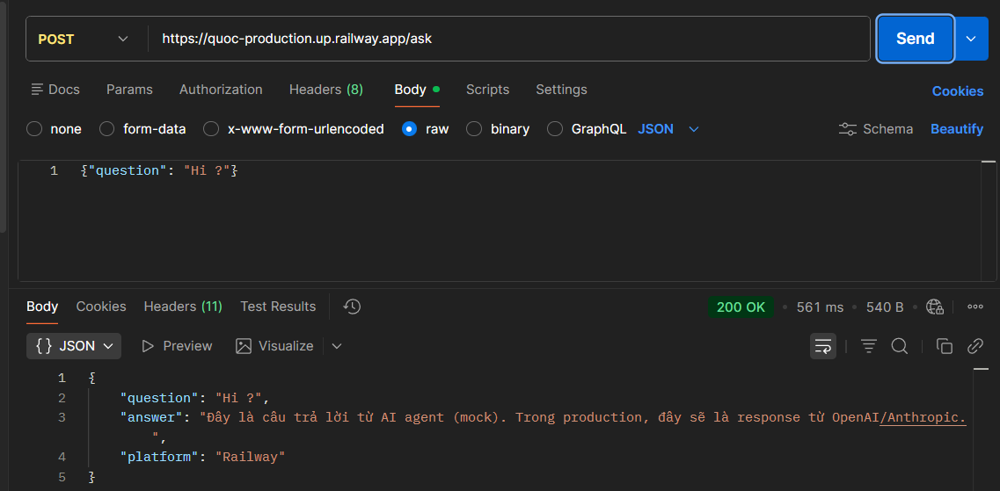
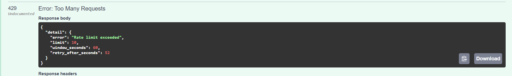
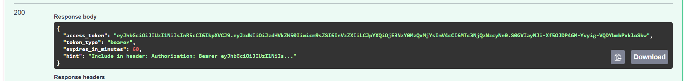
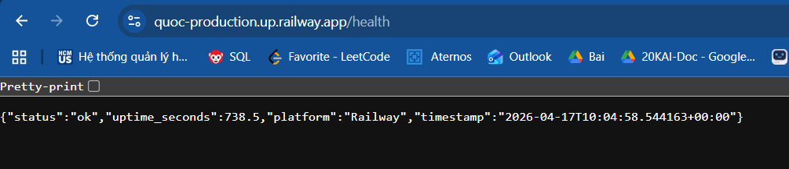
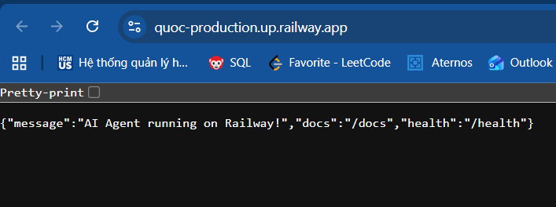
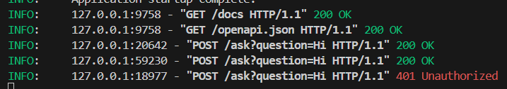

# Deployment Information

## Public URL
https://20a202600108-letrunganhquoc-day12-production.up.railway.app/

## Platform
Railway

## Test Commands


### Health Check
```bash
curl https://20a202600108-letrunganhquoc-day12-production.up.railway.app/health

{"status":"ok","uptime":62.2}

```

### API Test (with JWT authentication)
```bash
# BƯỚC 1: Lấy token
TOKEN=$(curl -X POST  https://20a202600108-letrunganhquoc-day12-production.up.railway.app/token \
  -H "Content-Type: application/json" \
  -d '{"username": "admin", "password": "secret"}' | jq -r '.access_token')
```


# BƯỚC 2: Gọi API ask
```bash
curl -X POST https://20a202600108-letrunganhquoc-day12-production.up.railway.app/ask \
  -H "Authorization: Bearer $TOKEN" \
  -H "Content-Type: application/json" \
  -d '{"question": "Hello, AI Agent!"}'
```

## Environment Variables Set
- `PORT`: 8000
- `REDIS_URL`: (Tự động từ Railway Redis)
- `JWT_SECRET`: quoc_secret_key_2026_day12
- `AGENT_API_KEY`: quoc123

## Screenshots
- **Deployment Dashboard:** 
- **Service Status:** 


- **Security Check:** 

