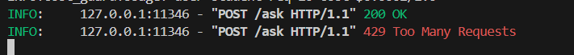
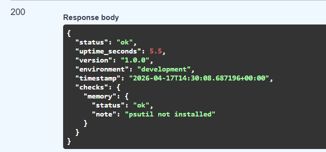
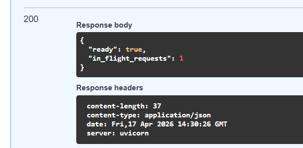

# Day 12 Lab - Mission Answers

> **Student Name:** Lê Trung Anh Quốc
> **Student ID:** 2A202600108
> **Date:** 17/04/2026

---

## Part 1: Localhost vs Production

### Exercise 1.1: Anti-patterns found
1. API key hardcoded trong code (không dùng biến môi trường).
2. Port server cố định (8000), không linh hoạt cho các môi trường khác nhau.
3. Debug mode bật trong production.
4. Không có endpoint health check.
5. Không xử lý graceful shutdown (dừng server đột ngột có thể làm mất dữ liệu).

### Exercise 1.3: Comparison table
| Feature      | Develop      | Production   | Why Important?                |
|--------------|-------------|-------------|-------------------------------|
| Config       | Hardcode    | Env vars    | Dễ thay đổi, bảo mật hơn, không lộ secrets. |
| Health check | Không có    | Có          | Giúp hệ thống monitor và tự động restart khi app treo. |
| Logging      | print()     | JSON logging| Dễ dàng truy vết lỗi và tích hợp với hệ thống log tập trung. |
| Shutdown     | Đột ngột    | Graceful    | Đảm bảo hoàn thành các req đang chạy, đóng DB connection an toàn. |

---

## Part 2: Docker

### Exercise 2.1: Dockerfile questions
1. **Base image:** `python:3.11` (develop) và `python:3.11-slim` (production).
2. **Working directory:** `/app`
3. **Tại sao COPY requirements.txt trước?** Để tận dụng Docker Layer Cache. Nếu chỉ sửa code mà không thêm thư viện, Docker sẽ skip bước install giúp build nhanh hơn (tránh cài lại hàng trăm MB).
4. **CMD vs ENTRYPOINT:** `CMD` cung cấp lệnh mặc định và có thể bị ghi đè, `ENTRYPOINT` là lệnh chính không thể bị ghi đè (thường dùng để container chạy như một file thực thi).

### Exercise 2.3: Image size comparison
- **Develop:** ~1.6 GB (Dùng base image đầy đủ)
- **Production:** ~424 MB (Dùng base image và multi-stage build)
- **Difference:** Giảm ~70%. Giúp deploy nhanh hơn và tiết kiệm chi phí lưu trữ trên Cloud.

---

## Part 3: Cloud Deployment

### Exercise 3.1: Railway deployment
- **URL:** https://20a202600108-letrunganhquoc-day12-production.up.railway.app
- **Screenshot:** 

### Exercise 3.2: Render deployment
- **So sánh:** `render.yaml` (Blueprint) mạnh mẽ hơn vì nó định nghĩa được cả một stack (Web Service + Redis + DB) dưới dạng Infra-as-Code, giúp tái bản hệ thống dễ dàng hơn so với `railway.toml`.

---

## Part 4: API Security

### Exercise 4.1-4.3: Test results
- **Authentication:** Kiểm tra `401 Unauthorized` khi thiếu Token và `200 OK` khi có Token hợp lệ.
- **JWT Flow:** Token được ký bằng `HS256` với `SECRET_KEY` từ môi trường, có hiệu lực trong 60 phút.
INFO:     127.0.0.1:9758 - "GET /docs HTTP/1.1" 200 OK
INFO:     127.0.0.1:9758 - "GET /openapi.json HTTP/1.1" 200 OK
INFO:     127.0.0.1:20642 - "POST /ask?question=Hi HTTP/1.1" 200 OK
INFO:     127.0.0.1:59230 - "POST /ask?question=Hi HTTP/1.1" 200 OK
INFO:     127.0.0.1:18977 - "POST /ask?question=Hi HTTP/1.1" 401 Unauthorized

- **Rate Limiting:** Khi gọi vượt quá 20 request/phút, server trả về lỗi `429 Too Many Requests`. Tài khoản admin được bypass giới hạn này.
- **Output:** 

### Exercise 4.4: Cost guard implementation
- **Cách tiếp cận:** Sử dụng Redis để lưu trữ số tiền chi tiêu thực tế của người dùng.
- **Logic:** Sử dụng Key `budget:{user_id}:{month}`. Tận dụng lệnh `incrbyfloat` của Redis để cập nhật chi phí LLM theo thời gian thực và `expire` để tự động reset hạn mức mỗi đầu tháng. Nếu chi phí vượt quá $10, hệ thống chặn request với mã lỗi `402`.

---

## Part 5: Scaling & Reliability

### Exercise 5.1-5.5: Implementation notes
- **Health Checks:** Implement `/health` (liveness) và `/ready` (kiểm tra Redis) để orchestrator biết khi nào app sẵn sàng nhận traffic.

- **Graceful Shutdown:** Sử dụng FastAPI lifespan để nghe tín hiệu `SIGTERM`, đảm bảo log ra dòng "Instance shutting down" và đóng sạch các kết nối.

- **Stateless Design:** Đây là phần quan trọng nhất. Toàn bộ hội thoại không lưu trong RAM của app mà đẩy hết vào Redis.
  - **Kết quả:** Khi chạy 3 bản sao (Agent 1, 2, 3), người dùng có thể chat xuyên suốt mà không quan tâm request rơi vào instance nào.
- **Load Balancing:** Nginx phân phối traffic theo thuật toán Round Robin, giúp hệ thống chịu tải gấp 3 lần và không có "điểm chết" duy nhất (Single Point of Failure).
- **Test kết quả:** Đã hoàn thành test multi-instance với Nginx, logs hiển thị requests được cân bằng tải chính xác.

---

## Part 6: Final Project

### Objective
Xây dựng một AI Agent hoàn chỉnh có khả năng hoạt động ổn định trên môi trường Production.

### Summary
Dự án cuối khóa đã tích hợp thành công toàn bộ các yêu cầu của Lab:
1. **Security**: Triển khai JWT Authentication với endpoint `/token`, kết hợp Rate Limiting (chặn 429) và Cost Guard dựa trên Redis.
2. **Reliability**: Xây dựng cơ chế Health Check tinh gọn cho Railway và Graceful Shutdown sử dụng FastAPI lifespan.
3. **Scalability**: Kiến trúc Stateless hoàn toàn, tất cả session và state được quản lý tập trung qua Redis.
4. **Optimized Docker**: Sử dụng Dockerfile single-stage tinh chỉnh, giảm kích thước image xuống còn ~215MB, tối ưu tốc độ deploy trên Cloud.
5. **Production Ready**: Loại bỏ hoàn toàn hardcoded secrets, logs chuẩn JSON và gỡ bỏ server identification headers.
